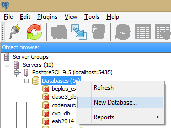
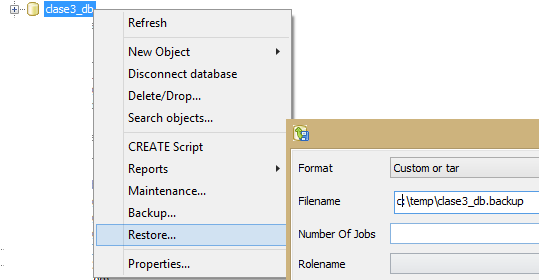

# clase 3

## preparación

Primero vamos a crear una base de datos en blanco y levantar el backup que nos bajamos de [acá](../bases/clase3_db.backup) y la llamamos `clase3_db` 

. 

Luego levantamos el backup 

. 

## desarrollo

Vamos a agregar variables calculadas sobre las tablas para facilitar la explotación posterior.

Como algunos tabulados son calculados por vivienda vamos a crear una tabla de viviendas

```
CREATE TABLE viviendas(
  id integer,
  comuna integer,
  dominio integer,
  v2_2 integer,
  v4 integer,
  fexp integer,
  primary key (id),
  constraint "fexp_gt_0" 
    check (fexp > 0)
);
```

Insertemos los datos de vivienda seleccionando los campos de la encuesta que 
corresponden a las viviendas y filtremos por el hogar 1.

```sql
INSERT INTO viviendas (id, comuna, dominio, v2_2, v4, fexp)
  SELECT id, comuna, dominio, v2_2, v4, fexp
    FROM eah2015_usuarios_hog
    WHERE nhogar=1;
```

Luego vamos a crear una tabla hogares que solo tiene las columnas que corresponden a los datos de hogar:

```sql
CREATE TABLE hogares AS
  SELECT id, nhogar, h2, h3, hacinam_2, tipoho
    FROM eah2015_usuarios_hog;
```


Los nombre y tipos de las columnas se basaron en el SELECT, pero la clave principal hay que crearla a mano

```sql
ALTER TABLE hogares 
  ADD PRIMARY KEY (id, nhogar);
```

Vamos a indicar que el campo id de hogares refiere al campo id de viviendas (y que no quiero que me permita agregar un hogar con un id que no esté en la tabla de viviendas)

```sql
ALTER TABLE hogares 
  ADD FOREIGN KEY (id) REFERENCES viviendas (id);
```

Ahora agreguemos una columna donde poner el valor de una variable calculada. Empecemos con `cant_mie` la cantidad de miembros que tiene un hogar.

```sql
ALTER TABLE hogares 
  ADD COLUMN cant_mie integer;
```

y otra columna para agrupar los hogares según el tamaño y el hacinamiento

```sql
ALTER TABLE hogares 
  ADD COLUMN grupo_th integer;
```

Nos faltó crear la tabla miembros, para ello hacemos que las columnas sean todas

```sql
CREATE TABLE miembros AS
  SELECT *
    FROM eah2015_usuarios_ind;
```

```sql
ALTER TABLE miembros 
  ADD FOREIGN KEY (id, nhogar) REFERENCES hogares (id, nhogar);
```


Vamos a actualizar el campo cant_mie.

```sql
UPDATE hogares as h
  SET cant_mie = (SELECT count(*) 
                    FROM miembros as m
                    WHERE m.id = h.id 
                      AND m.nhogar = h.nhogar);
```

Imaginemos un criterio para agrupar hogares de más de 5 miembros o de hacinamiento 3. Los vamos a marcar con un 1.

```sql
UPDATE hogares as h
  SET grupo_th = 1
  WHERE hacinam_2 = 3
     OR cant_mie > 5;
```

O mejor que la marca sea un 1 si se cumple una condición o un 2 si se cumplen ambas:

```sql
UPDATE hogares as h
  SET grupo_th = CASE WHEN hacinam_2 = 3 AND cant_mie > 5 THEN 2 ELSE 1 END
  WHERE hacinam_2 = 3
     OR cant_mie > 5;
```

Borremos las viviendas de dominio 3

```sql
DELETE FROM viviendas
  WHERE dominio = 3;
```